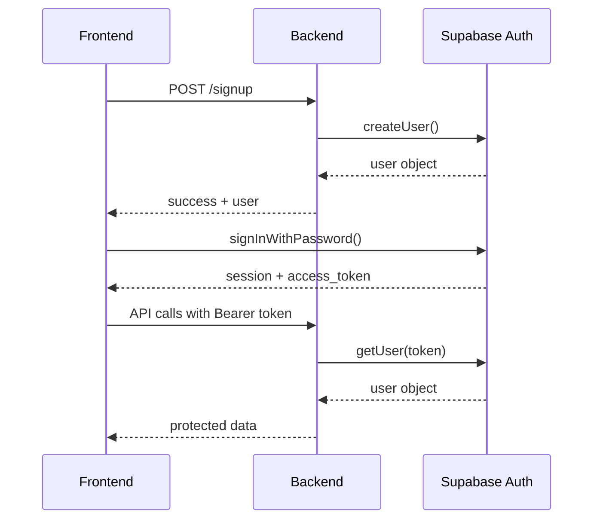

# 📚 Référence Technique Complète - Premunia CRM

## 🗄️ Architecture de la Base de Données

### Vue d'ensemble du KV Store

Le système utilise **Supabase KV Store**, une table PostgreSQL pré-configurée nommée `kv_store_07afcff5`.

#### Structure de la Table KV
```sql
CREATE TABLE kv_store_07afcff5 (
  key TEXT PRIMARY KEY,
  value JSONB NOT NULL,
  created_at TIMESTAMP DEFAULT NOW(),
  updated_at TIMESTAMP DEFAULT NOW()
);
```

### Schéma des Données

#### 1. Leads
**Préfixe de clé** : `lead_`

```typescript
interface Lead {
  id: string;                    // "lead_1707923456789_abc123"
  first_name: string;            // "Jean"
  last_name: string;             // "Dupont"
  email: string;                 // "jean.dupont@example.com"
  phone: string;                 // "0612345678"
  profession: string;            // "Médecin"
  message?: string;              // Message optionnel
  status: string;                // "new" | "contacted" | "qualified" | "converted"
  notes?: string;                // Notes internes
  created_at: string;            // ISO 8601 timestamp
  updated_at: string;            // ISO 8601 timestamp
}
```

**Exemple de données** :
```json
{
  "id": "lead_1707923456789_abc123",
  "first_name": "Marie",
  "last_name": "Martin",
  "email": "marie.martin@medical.fr",
  "phone": "0687654321",
  "profession": "Chirurgien-dentiste",
  "message": "Intéressée par optimisation fiscale",
  "status": "new",
  "created_at": "2026-02-13T14:30:00.000Z",
  "updated_at": "2026-02-13T14:30:00.000Z"
}
```

#### 2. Paramètres de l'Application
**Clé** : `app_settings`

```typescript
interface AppSettings {
  hero_title: string;
  hero_subtitle: string;
  contact_email: string;
  contact_phone: string;
  contact_address: string;
  company_name?: string;
  tagline?: string;
  about_text?: string;
}
```

**Valeurs par défaut** :
```json
{
  "hero_title": "Préparez votre retraite sans sacrifier votre présent",
  "hero_subtitle": "Le Plan Épargne Retraite (PER) sur-mesure pour les professions libérales : optimisez votre fiscalité dès aujourd'hui.",
  "contact_email": "contact@premunia.fr",
  "contact_phone": "01 00 00 00 00",
  "contact_address": "828 Av. Roger Salengro, 92370 Chaville"
}
```

#### 3. Rôles Utilisateur
**Préfixe de clé** : `user_role_`

```typescript
interface UserRole {
  role: "user" | "admin";
  updated_at: string;
}
```

**Clé complète** : `user_role_${user.id}`

**Exemple** :
```json
{
  "role": "admin",
  "updated_at": "2026-02-13T10:00:00.000Z"
}
```

#### 4. Configuration SMTP
**Clé** : `smtp_config`

```typescript
interface SMTPConfig {
  host: string;                  // "smtp.gmail.com"
  port: number;                  // 587 ou 465
  secure: boolean;               // true pour port 465
  user: string;                  // "noreply@premunia.fr"
  password: string;              // Mot de passe (jamais retourné au frontend)
  from_name: string;             // "Premunia"
  from_email: string;            // "contact@premunia.fr"
}
```

---

## 🔌 API Reference Complète

### Base URL
```
https://gfedfklnzkgifpdxrybh.supabase.co/functions/v1/make-server-07afcff5
```

### Headers Communs
```typescript
// Pour endpoints publics
{
  "Content-Type": "application/json",
  "Authorization": "Bearer ${publicAnonKey}"
}

// Pour endpoints protégés
{
  "Content-Type": "application/json",
  "Authorization": "Bearer ${accessToken}"
}
```

---

### Endpoints Publics

#### 1. Health Check
```http
GET /health
```

**Réponse** :
```json
{
  "status": "ok"
}
```

**Status codes** :
- `200` : Backend opérationnel

---

#### 2. Récupérer les Paramètres
```http
GET /settings
```

**Réponse** :
```json
{
  "hero_title": "Titre principal",
  "hero_subtitle": "Sous-titre",
  "contact_email": "contact@premunia.fr",
  "contact_phone": "01 00 00 00 00",
  "contact_address": "Adresse complète"
}
```

**Status codes** :
- `200` : Succès
- `500` : Erreur serveur

---

#### 3. Créer un Lead
```http
POST /leads
Content-Type: application/json

{
  "first_name": "Jean",
  "last_name": "Dupont",
  "email": "jean@example.com",
  "phone": "0612345678",
  "profession": "Médecin",
  "message": "Message optionnel"
}
```

**Réponse** :
```json
{
  "success": true,
  "leadId": "lead_1707923456789_abc123"
}
```

**Validation** :
- `first_name` : requis
- `last_name` : requis
- `email` : requis, format email
- `phone` : requis
- `profession` : requis
- `message` : optionnel

**Status codes** :
- `200` : Lead créé
- `400` : Champs manquants
- `500` : Erreur serveur

---

#### 4. Créer un Utilisateur
```http
POST /signup
Content-Type: application/json

{
  "email": "admin@premunia.fr",
  "password": "motdepasse123",
  "name": "Admin Premunia"
}
```

**Réponse** :
```json
{
  "success": true,
  "user": {
    "id": "uuid-here",
    "email": "admin@premunia.fr",
    "user_metadata": {
      "name": "Admin Premunia"
    }
  }
}
```

**Status codes** :
- `200` : Utilisateur créé
- `400` : Email déjà utilisé ou données invalides
- `500` : Erreur serveur

---

### Endpoints Protégés (Auth Required)

#### 5. Liste des Leads
```http
GET /leads
Authorization: Bearer ${accessToken}
```

**Réponse** :
```json
{
  "leads": [
    {
      "id": "lead_1707923456789_abc123",
      "first_name": "Jean",
      "last_name": "Dupont",
      "email": "jean@example.com",
      "phone": "0612345678",
      "profession": "Médecin",
      "status": "new",
      "created_at": "2026-02-13T14:30:00.000Z"
    }
  ]
}
```

**Status codes** :
- `200` : Succès
- `401` : Non authentifié
- `500` : Erreur serveur

---

#### 6. Modifier un Lead
```http
PUT /leads/:id
Authorization: Bearer ${accessToken}
Content-Type: application/json

{
  "status": "contacted",
  "notes": "Appelé le 13/02, intéressé"
}
```

**Réponse** :
```json
{
  "success": true,
  "lead": {
    "id": "lead_1707923456789_abc123",
    "status": "contacted",
    "notes": "Appelé le 13/02, intéressé",
    "updated_at": "2026-02-13T15:00:00.000Z"
  }
}
```

**Status codes** :
- `200` : Lead mis à jour
- `401` : Non authentifié
- `404` : Lead introuvable
- `500` : Erreur serveur

---

#### 7. Supprimer un Lead
```http
DELETE /leads/:id
Authorization: Bearer ${accessToken}
```

**Réponse** :
```json
{
  "success": true
}
```

**Status codes** :
- `200` : Lead supprimé
- `401` : Non authentifié
- `500` : Erreur serveur

---

#### 8. Modifier les Paramètres
```http
PUT /settings
Authorization: Bearer ${accessToken}
Content-Type: application/json

{
  "hero_title": "Nouveau titre",
  "hero_subtitle": "Nouveau sous-titre",
  "contact_email": "nouveau@premunia.fr"
}
```

**Réponse** :
```json
{
  "success": true
}
```

**Status codes** :
- `200` : Paramètres mis à jour
- `401` : Non authentifié
- `500` : Erreur serveur

---

#### 9. Récupérer le Rôle Utilisateur
```http
GET /user/role
Authorization: Bearer ${accessToken}
```

**Réponse** :
```json
{
  "role": "admin"
}
```

**Status codes** :
- `200` : Succès
- `401` : Non authentifié
- `500` : Erreur serveur

---

#### 10. Promouvoir en Admin
```http
POST /promote-admin
Authorization: Bearer ${accessToken}
```

**Réponse** :
```json
{
  "success": true,
  "role": "admin"
}
```

**Status codes** :
- `200` : Promotion réussie
- `401` : Non authentifié
- `500` : Erreur serveur

---

#### 11. Récupérer Config SMTP
```http
GET /smtp-config
Authorization: Bearer ${accessToken}
```

**Réponse** :
```json
{
  "host": "smtp.gmail.com",
  "port": 587,
  "secure": false,
  "user": "noreply@premunia.fr",
  "from_name": "Premunia",
  "from_email": "contact@premunia.fr"
}
```

⚠️ **Note** : Le mot de passe n'est jamais retourné

**Status codes** :
- `200` : Succès
- `401` : Non authentifié
- `500` : Erreur serveur

---

#### 12. Modifier Config SMTP
```http
PUT /smtp-config
Authorization: Bearer ${accessToken}
Content-Type: application/json

{
  "host": "smtp.gmail.com",
  "port": 587,
  "secure": false,
  "user": "noreply@premunia.fr",
  "password": "motdepasse",
  "from_name": "Premunia",
  "from_email": "contact@premunia.fr"
}
```

**Réponse** :
```json
{
  "success": true
}
```

**Status codes** :
- `200` : Configuration mise à jour
- `401` : Non authentifié
- `500` : Erreur serveur

---

## 🔐 Authentification

### Flux d'Authentification



### Récupérer un Access Token (Frontend)

```typescript
import { supabase } from './utils/supabase';

async function getAccessToken() {
  const { data: { session } } = await supabase.auth.getSession();
  return session?.access_token;
}
```

### Vérifier l'Authentification (Backend)

```typescript
const accessToken = c.req.header('Authorization')?.split(' ')[1];
const { data: { user }, error } = await supabase.auth.getUser(accessToken);

if (!user) {
  return c.json({ error: 'Unauthorized' }, 401);
}
```

---

## 🛠️ Fonctions Utilitaires KV Store

### Disponibles dans `/supabase/functions/server/kv_store.tsx`

#### get(key: string)
Récupère une valeur unique.

```typescript
const settings = await kv.get('app_settings');
// Returns: { hero_title: "...", ... } | null
```

#### set(key: string, value: any)
Stocke ou met à jour une valeur.

```typescript
await kv.set('app_settings', {
  hero_title: "Nouveau titre",
  contact_email: "contact@premunia.fr"
});
```

#### del(key: string)
Supprime une clé.

```typescript
await kv.del('lead_1707923456789_abc123');
```

#### getByPrefix(prefix: string)
Récupère toutes les valeurs dont la clé commence par le préfixe.

```typescript
const allLeads = await kv.getByPrefix('lead_');
// Returns: Array<Lead>
```

#### mget(keys: string[])
Récupère plusieurs valeurs.

```typescript
const values = await kv.mget([
  'app_settings',
  'smtp_config',
  'lead_123'
]);
```

#### mset(entries: Array<[string, any]>)
Stocke plusieurs valeurs.

```typescript
await kv.mset([
  ['key1', { data: 'value1' }],
  ['key2', { data: 'value2' }]
]);
```

#### mdel(keys: string[])
Supprime plusieurs clés.

```typescript
await kv.mdel([
  'lead_1',
  'lead_2',
  'lead_3'
]);
```

---

## 📦 Stack Technique Frontend

### Dépendances Principales

```json
{
  "@supabase/supabase-js": "^2.95.3",
  "@tanstack/react-query": "^5.90.21",
  "react-router": "7.13.0",
  "recharts": "2.15.2",
  "lucide-react": "0.487.0",
  "sonner": "2.0.3",
  "tailwindcss": "4.1.12"
}
```

### Configuration React Query

```typescript
const queryClient = new QueryClient({
  defaultOptions: {
    queries: {
      refetchOnWindowFocus: false,
      retry: 1,
    },
  },
});
```

### Exemple d'utilisation

```typescript
// Fetch data
const { data, isLoading, error } = useQuery({
  queryKey: ['leads'],
  queryFn: () => apiCall('/leads'),
});

// Mutation
const mutation = useMutation({
  mutationFn: (data) => apiCall('/leads', {
    method: 'POST',
    body: JSON.stringify(data),
  }),
  onSuccess: () => {
    queryClient.invalidateQueries({ queryKey: ['leads'] });
    toast.success('Lead créé !');
  },
});
```

---

## 🎨 Système de Design

### Couleurs Premunia

```typescript
const COLORS = {
  orange: '#F79E1B',   // Orange principal
  coral: '#EE3B33',    // Rouge coral
  magenta: '#E91E63',  // Magenta
  purple: '#880E4F',   // Violet foncé
};
```

### Classes Tailwind Personnalisées

```css
/* Gradient principal */
bg-gradient-to-r from-[#EE3B33] to-[#880E4F]

/* Bouton primaire */
bg-[#EE3B33] hover:bg-[#880E4F]

/* Badge orange */
bg-orange-100 text-[#F79E1B]

/* Bordure */
border-[#EE3B33]
```

---

## 🔧 Configuration Environnement

### Variables Supabase (Auto-générées)

```typescript
// /utils/supabase/info.tsx
export const projectId = "gfedfklnzkgifpdxrybh";
export const publicAnonKey = "eyJhbGci...";
```

### URLs Construites

```typescript
const SUPABASE_URL = `https://${projectId}.supabase.co`;
const API_URL = `${SUPABASE_URL}/functions/v1/make-server-07afcff5`;
```

---

## 🚀 Déploiement

### Backend (Supabase Edge Functions)

Le backend est déjà déployé automatiquement sur :
```
https://gfedfklnzkgifpdxrybh.supabase.co/functions/v1/make-server-07afcff5
```

### Frontend

Le frontend est servi via Vite/React et déployé sur l'infrastructure Figma Make.

---

## 📊 Monitoring et Logs

### Logs Backend (Supabase)

Accédez aux logs via :
1. Supabase Dashboard
2. Functions → server
3. Logs tab

### Format des Logs

```
[2026-02-13T14:30:00.000Z] GET /make-server-07afcff5/leads
[2026-02-13T14:30:01.000Z] Lead created: lead_123 - user@email.com
```

### Logs Frontend (Console)

```typescript
console.log('API call:', endpoint, options);
console.error('Error:', error.message);
```

---

## 🧪 Tests Automatiques

### Suite de Tests (`/system-test`)

1. **Health Check** : Vérifie que l'API répond
2. **Settings** : Teste GET public
3. **Lead Creation** : Teste POST public
4. **Auth Session** : Vérifie la session active
5. **Access Token** : Récupère le token
6. **Fetch Leads** : Teste GET protégé
7. **User Role** : Vérifie le rôle
8. **SMTP Config** : Teste la config email
9. **Database** : Teste la connexion KV
10. **Frontend** : Vérifie les dépendances

---

## 📈 Performance

### Optimisations Implémentées

1. **React Query Caching** : Données mises en cache
2. **Lazy Loading** : Routes chargées à la demande
3. **KV Store Indexing** : Recherche rapide par préfixe
4. **Token Caching** : Access token mis en cache
5. **Image Optimization** : CDN Uploadcare

### Métriques Cibles

- **API Response Time** : < 200ms
- **Frontend Load** : < 2s
- **TTI (Time to Interactive)** : < 3s

---

## 🔒 Sécurité

### Mesures de Protection

1. **JWT Authentication** : Tokens signés
2. **CORS** : Configuration stricte
3. **Validation** : Données validées côté serveur
4. **Sanitization** : Prévention XSS
5. **Rate Limiting** : (à implémenter si besoin)

### Bonnes Pratiques

```typescript
// ✅ BON : Utiliser access token
const token = await getAccessToken();

// ❌ MAUVAIS : Exposer service role key
const key = SUPABASE_SERVICE_ROLE_KEY; // JAMAIS côté client !
```

---

## 📝 Exemples de Code

### Créer un Lead (Frontend)

```typescript
import { useMutation } from '@tanstack/react-query';
import { API_URL, publicAnonKey } from '../utils/supabase';
import { toast } from 'sonner';

const createLead = useMutation({
  mutationFn: async (formData) => {
    const response = await fetch(`${API_URL}/leads`, {
      method: 'POST',
      headers: {
        'Content-Type': 'application/json',
        'Authorization': `Bearer ${publicAnonKey}`,
      },
      body: JSON.stringify(formData),
    });
    
    if (!response.ok) throw new Error('Failed');
    return response.json();
  },
  onSuccess: () => {
    toast.success('Lead créé !');
  },
});
```

### Récupérer les Leads (Frontend)

```typescript
import { useQuery } from '@tanstack/react-query';
import { apiCall } from '../utils/supabase';

function LeadsList() {
  const { data, isLoading } = useQuery({
    queryKey: ['leads'],
    queryFn: () => apiCall('/leads'),
  });

  if (isLoading) return <div>Chargement...</div>;

  return (
    <ul>
      {data?.leads.map(lead => (
        <li key={lead.id}>{lead.email}</li>
      ))}
    </ul>
  );
}
```

### Ajouter un Endpoint (Backend)

```typescript
// /supabase/functions/server/index.tsx

app.get("/make-server-07afcff5/custom", async (c) => {
  try {
    // Auth optionnelle
    const token = c.req.header('Authorization')?.split(' ')[1];
    const { data: { user } } = await supabase.auth.getUser(token);
    
    if (!user) {
      return c.json({ error: 'Unauthorized' }, 401);
    }
    
    // Logique métier
    const result = await kv.get('custom_data');
    
    return c.json({ success: true, data: result });
  } catch (error) {
    console.error('Error:', error);
    return c.json({ error: 'Failed' }, 500);
  }
});
```

---

## 🎯 Cas d'Usage Avancés

### Filtrer les Leads par Statut

```typescript
const newLeads = leads.filter(lead => lead.status === 'new');
const contactedLeads = leads.filter(lead => lead.status === 'contacted');
```

### Recherche Full-Text

```typescript
const searchTerm = 'médecin';
const results = leads.filter(lead => 
  lead.first_name.toLowerCase().includes(searchTerm) ||
  lead.last_name.toLowerCase().includes(searchTerm) ||
  lead.profession.toLowerCase().includes(searchTerm)
);
```

### Export CSV

```typescript
function exportToCSV(leads: Lead[]) {
  const headers = ['Nom', 'Email', 'Téléphone', 'Profession', 'Statut'];
  const rows = leads.map(lead => [
    `${lead.first_name} ${lead.last_name}`,
    lead.email,
    lead.phone,
    lead.profession,
    lead.status,
  ]);
  
  const csv = [
    headers.join(','),
    ...rows.map(row => row.join(','))
  ].join('\n');
  
  const blob = new Blob([csv], { type: 'text/csv' });
  const url = URL.createObjectURL(blob);
  const a = document.createElement('a');
  a.href = url;
  a.download = 'leads.csv';
  a.click();
}
```

---

**Dernière mise à jour** : 13 février 2026  
**Version** : 1.0.0  
**Maintenu par** : Premunia Tech Team
